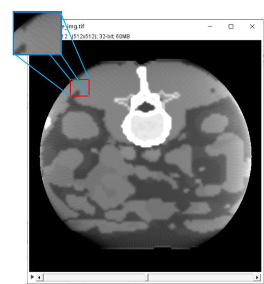
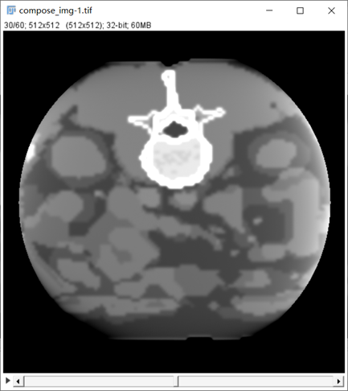
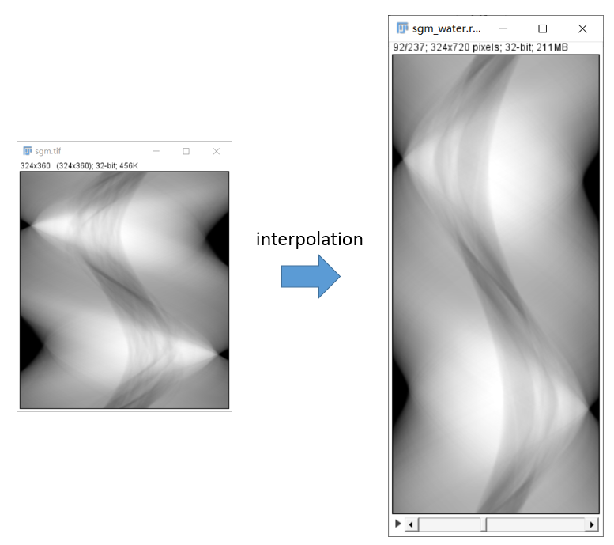

# 有限角伪影 (Limited view artifact)

### 1. 伪影的表现形式

如图所示，有限角伪影表现为从中心向四周辐射的条带状细线。

### 2. 伪影的产生原因

- 有限角，顾名思义，虽然投影范围达到了360°，但是每张投影之间间隔角度过大，导致 FBP 重建时，反向涂抹间隔较大，最终造成条带状细线。
- 上图是一度一投影的重建结果。事实上，一般 CT 投影间距会小于 1°，也就是采用 400-800 个投影角做重建。有限角伪影往往发生在模拟实验中，或是有低剂量需求，减少投影数的场景下发生。
- 另外，在低剂量下，或高散射比 scatter primary ratio (SPR, 即散射比不带散射的投影值 $ \frac{I_s}{I_p}$ ) 下，重建图像中的噪声会掩盖有限角伪影表现。在这种情况下，应优先矫正最影响图像质量的伪影。

### 3. 矫正方案

1. 最直接的方案就是增加投影数量，增加真实数据的投影数量，让重建的条带状细线结合的更加紧密，从而减轻有限角伪影。下图是用 720 个投影角重建的结果，其他参数不变，在同样分辨率下，有限角伪影几乎不可见。

2. 当有条件限制，不能做更多投影数量时，有另一个思考角度。即对正弦图做高度方向插值，相当于在真实投影之间补充虚拟投影，从而达到增加投影数的目的，减轻有限角伪影。

- 如下图所示左，中，右分别为在50kVp下，兔子的 400 投影角，200投影角正弦插值到400投影角，以及200投影角重建。

- 然而，毕竟增加的投影角并不是真实数据，加之使用双线性插值，会使得重建图像整体质量有一定下降，该方法并不严谨。

3. 其他的思路包括使用迭代重建方案，或者 DL 方案，这里暂不做深究。

*[注]：以上图片来自 ICRP 110 数字体模投影和小动物 CT，仅供学习参考*