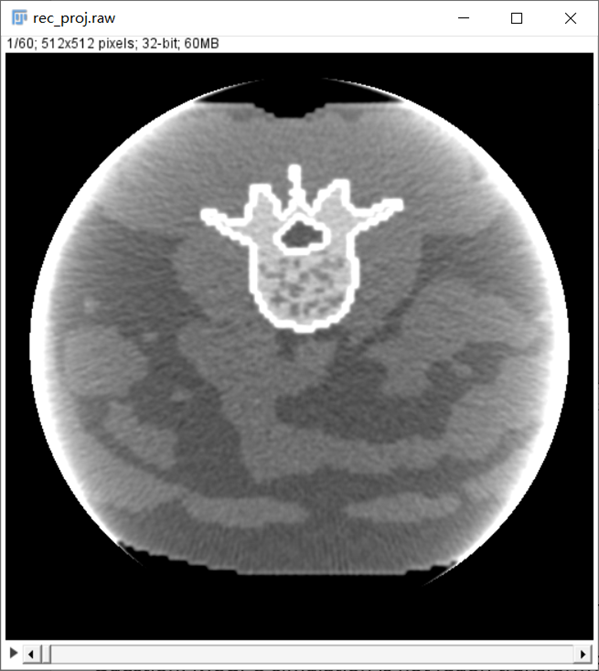
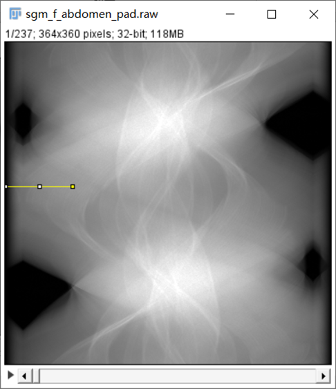
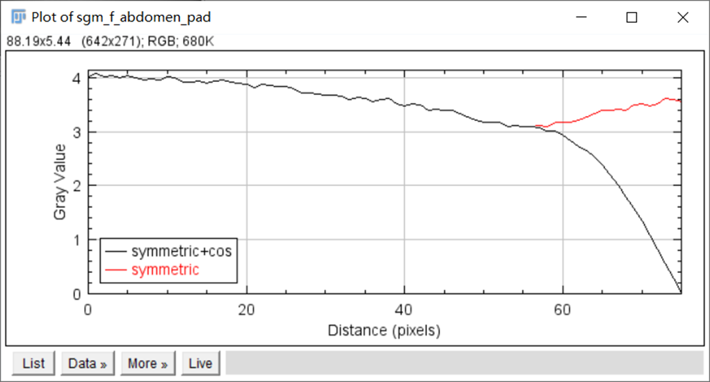
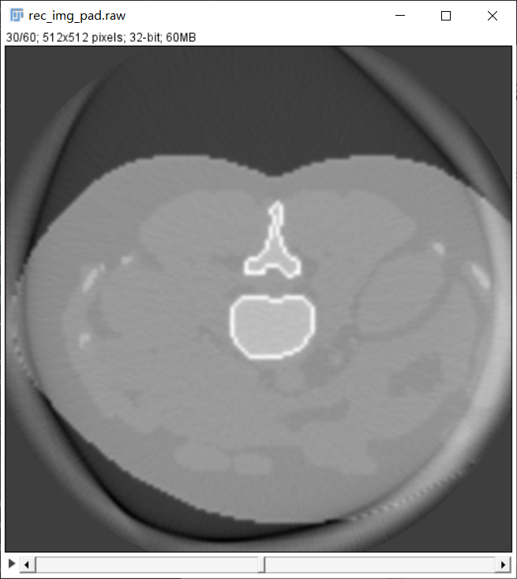
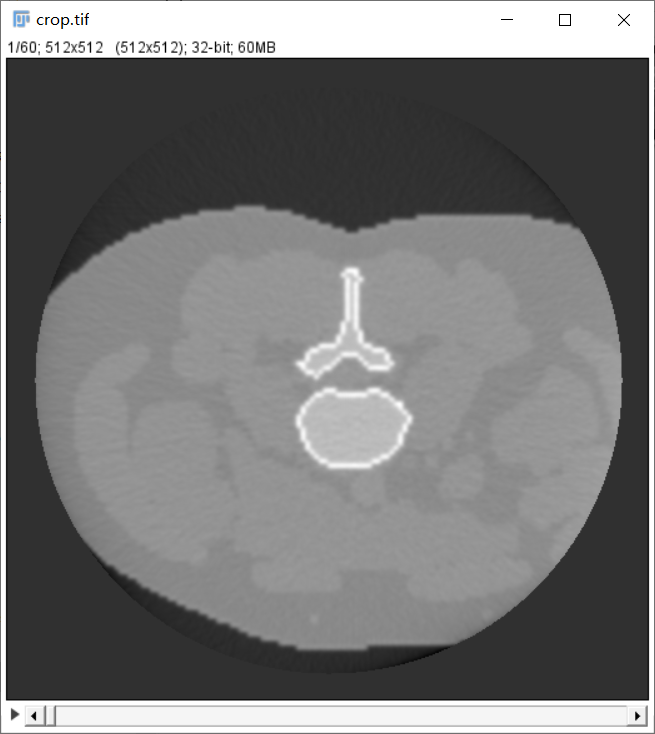

# 截断伪影 (Truncated artifact)

### 1. 伪影的表现形式

如图所示，截断伪影表现为图像边缘异常发亮，严重时无法观察边缘重建区域。

### 2. 伪影的产生原因

- 截断伪影主要由于被扫描物体超出探测器视野而产生，根据其超出长度会产生不同严重程度的光亮，进而影响图像边缘部分成像。
- 截断在正弦图 [(哪里有正弦图？)](https://github.com/CandleHouse/Toolbox#2-preprocess) 上表现为超出图像宽度的弦波，这正是截断伪影光亮的产生原因。因为在 FBP 中，对正弦图的卷积会在边缘部分产生大幅度变化，使得重建图像边界不均匀。

### 3. 矫正方案

- 对正弦图左右两侧做 padding 操作 (mode='symmetric' 或 'reflect' 皆可)，使得超出边界的正弦图均匀下降至0即可。由于超出图像边界的部分并不在探测器视野 (FOV) 中, 所以我们并不关心 padding 的值是否严格正确。

 

- padding 单侧长度一般为正弦图宽度的 10% (RTK)。
- 对 padding 后的正弦图进行重建，并根据探测器成像几何，裁剪出原来探测器视野FOV即可。

*[注]：以上图片来自 ICRP 110 数字体模投影，仅供学习参考*