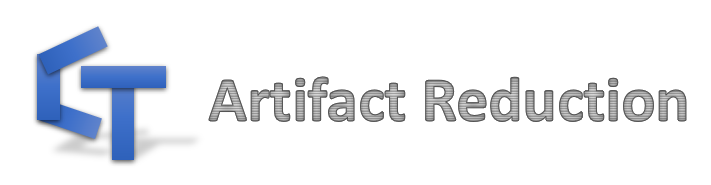

# Welcome to CT Artifact Reduction

一些 CT 图像中常见伪影的矫正或缓解的 **解析** 方案

### 伪影涵盖：
- [杯状伪影 (Cupping artifact)](./杯状伪影/杯状伪影.md)
    1. 水束硬化
    2. 散射

- [硬化伪影 (Beam-hardening artifact)](硬化伪影/硬化伪影.md)
    1. 水束硬化
    2. 骨硬化
    3. 金属硬化

- [环状伪影 (Ring artifact)](./环状伪影.md)

- [截断伪影 (Truncation artifact)](./截断伪影.md)

- [有限角伪影 (Limited view artifact)](./有限角伪影.md)
    1. 有限角度 (Limited angle)
    2. 稀疏视角 (Sparse view)
    
- [几何伪影 (Geometric artifact)](./几何伪影.md)

- 其他 (正在学习补充……)

### 内容包括：
- 伪影的表现形式

- 伪影的产生原因

- 经典矫正方案

- 代码实现

【注1】该项目也是 [crip](https://github.com/z0gSh1u/crip) 工具包的 **伪影矫正** 使用范例，结合食用效果更佳！

【注2】物质物理属性数据集 [NIST](附录.md#1-nist)
