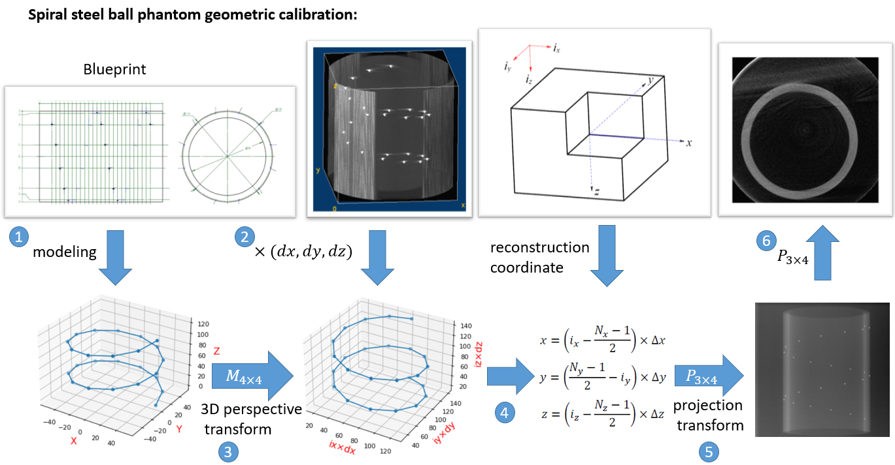

# 几何伪影 (Geometric artifact)

### 1. 伪影的表现形式

下图左侧为螺旋钢珠模体重建截面，右侧为脊椎模体重建截面。

<figure markdown>
  { width="500", loading=lazy }
    <figcaption>Fig 1. 几何伪影的表现形式</figcaption>
</figure>

### 2. 伪影的产生原因

**几何伪影由 CT 扫描期间 x 射线探测器和光源的非圆形轨迹引起。**对于临床或工业CT系统，旋转患者或特定重物是不可行的，因此，普遍采用旋转 x 射线源和探测器的机架。在这种情况下，几何参数在CT扫描过程中会发生抖动。如果在不同的 view 之间使用相同的几何参数，重建图像会表现出由几何形变和抖动产生的几何伪影。相较于诊断 CT ，开放式机架的 C-arm CT 几何伪影会更为严重，尤其是没有配备滑环会使得几何伪影更加明显。


### 3. 矫正方案

精确的几何伪影矫正需要测量计算出每个 view 的几何参数，然后用几何参数构造出每个 view 被扫描物体与探测器之间的**投影矩阵** pMatrix，最后用于重建。

#### 0. PMatrix

<span style="font-size: 26px;">[完整 pMatrix 定义说明 PDF](../PDF/pmatrix_fbp.pdf)</span>

pMatrix 的定义在不同 CT 系统软件中大相径庭，但其原理是相通的，此处我们以 [mangoct 系列软件](https://github.com/CandleHouse/mangoct) 中使用的 pMatrix 定义为准。

!!! note "注意"
    pMatrix 称之为**投影矩阵**，指代其拟合了被扫描的 3D 物体到 2D 探测器上的投影过程，而**不是指投影变换**。事实上，pMatrix 是拥有12个自由度的**仿射变换**矩阵。

通过文档，我们知道了：

1. **Theory**：如何根据已知几何参数构建出每个 view 的 pMatrix
2. **Experimental considerations**：如何根据重建图中的点 $(x_i,y_i,z_i)$ 和投影图中的对应点 $(u_i,v_i)$ 拟合出 pMatrix

Q：那么这两种获得 pMatrix 的方案有什么用呢？

A1：**Theory** 方案可以根据系统理想几何参数构建 pMatrix，使用这个 pMatrix 重建将与不带任何偏移参数的重建结果一致。这种方法主要用于**在线矫正**方案，通过对几何参数建模，优化得到每个 view 的参数估计，然后构建出 pMatrix 完成几何矫正。

A2：**Experimental considerations** 方案主要用于**离线矫正**，特指使用钢珠模体的传统矫正方法，通过找点拟合，直接构建出 pMatrix 完成几何矫正。


#### 方案1. 离线矫正 —— 螺旋钢珠模体几何矫正

<figure markdown>

  <figcaption>Fig 2. 螺旋钢珠模体几何矫正流程</figcaption>
</figure>

**坐标系定义：**

| Name                                                         | Coordinate system |
| :----------------------------------------------------------- | ----------------- |
| 模体设计蓝图坐标系，三维坐标零点在 3D 模型底部中心           | $O_{xyz}^b$       |
| FDK 重建图像坐标系，实图，三维坐标零点在重建的第一片 slice 一角 | $O_{xyz}^{FDK}$   |
| 重建程序坐标系，三维坐标零点在 3D volume 整体中心            | $O_{xyz}^{m}$     |

**使用螺旋钢珠几何矫正分为以下六步：**

1. 根据模体设计蓝图，定义出蓝图坐标系 $O_{xyz}^b$，并生成螺旋钢珠组的三维坐标 $B^b_{img}$。

2. 用未校正的投影图，根据理想几何，直接重建带几何伪影的CT图。并从CT图的不同层找到钢珠位置，即找到实图坐标系 $O_{xyz}^{FDK}$ 中钢珠三维坐标 $B^{FDK}_{img}$。（需要乘上物理尺寸，方便下一步仿射变换，尤其是在 Z轴 bin 过时；除此之外，乘上物理尺寸使得全局变换中钢珠三维坐标单位都是实际物理长度）

3. 拟合螺旋钢珠组坐标从蓝图标系  $O_{xyz}^b$ 到实图坐标系 $O_{xyz}^{FDK}$ 的 3-D 仿射变换矩阵 $M_1=(B_{img}^b)^{+}B_{img}^{FDK}$。（上一步中由于对齐了物理尺寸，这一步仿射变换能拟合很好。）此时用拟合到实图坐标系的蓝图钢珠三维坐标 $M_1 B^b_{img}$ 作为校准目标，后续的几何矫正会把重建图中发生偏移的钢珠校准到当前位置。

4. 根据使用的重建程序，将钢珠三维坐标 $M_1 B^b_{img}$ 移动到重建坐标系  $O_{xyz}^{m}$ 中，得到最终校准目标位置 $M_2M_1 B^b_{img}$ 。

5. 拟合投影图钢珠坐标 $B_{proj}$ 到目标位置 $M_2M_1 B^b_{img}$ 的投影变换，即为 pMatrix。

6. 用 pMatrix 重建。

!!! warning "注意"

    1. 使用蓝图拟合变换矩阵 $M_1$ 的作用是要求钢珠之间**相对位置**正确，坐标空间绝对位置不做要求。而实图钢珠**绝对位置**正确，钢珠之间的相对位置不一定正确。
    2. 注意单位。在整个校准流程中，我们使用了两次找钢珠点坐标操作（找点是在无物理尺寸上的图像上进行的，没有单位）：
    	- 一次是在步骤 2 的重建图中 $B^{FDK}_{img}$，需要乘上物理尺寸保证整个流程钢珠坐标都表示物理尺寸，也方便拟合
        - 一次是在步骤 5 的 $B_{proj}$ ，**我们将物理尺寸放入了 pMatrix 拟合中**，所以步骤 5 实际是无单位的 $B_{proj}$ 拟合到有单位的目标位置 $M_2M_1 B^b_{img}$ 过程

!!! note "提示"
    上述几何矫正流程可以按迭代方式再次执行这六个步骤，以进一步提升矫正精度

!!! hint "提示"
    有条件的同学可以使用 [mandoct ](https://github.com/SEU-CT-Recon/mandoct) 重建。相比于 mangoct，支持在 fan/cone beam **投影**中使用 pMatrix，此外还有其他诸多改进。

<figure markdown>
  { width="700", loading=lazy }
    <figcaption>Fig 3. 基于螺旋钢珠模体的几何矫正</figcaption>
</figure>

#### 1.1 通过 pMatrix 反解几何参数

!!! help "提示"
    由 **Theory** 方法构建出的 pMatrix 无需反解参数，因为构建 pMatrix 前每个 view 所有几何参数已经完全掌握。

通过 **Experimental considerations**  方案，我们直接用最小二乘拟合出了 pMatrix，但系统的几何参数无从知晓。通过参数反解，可以得到该系统各个参数的实际偏移，可以用于仿真实验模拟或者结构参数标定。可以说反解 pMatrix 十分重要。


- **光源到中心，光源到探测器距离 $SID\ \&\ SDD$**

       $pMatrix=[A^{-1},-A^{-1}\vec{x}_s]$
       
       $A=[\hat{e}_u,\hat{e}_v,\vec{x}_{do}-\hat{x}_s]=(pMatrix[:][0:3])^{-1}$
       
       则：$\vec{x}_s=A\cdot -pMatrix[:][3]$，$\vec{x}_{do}=A[:][2]+\vec{x}_s$
       
       $\vec{x}_{do}$ 是探测器一角 (1, 1) 对应的位置，需要换算到探测器中心的位置 $\vec{x}_{d}$
       
       $\vec{x}_{d}=\vec{x}_{do}+\frac{nu-1}{2}\times \hat{e}_u+\frac{nv-1}{2}\times\hat{e}_v$
       
       最后，SID 和 SDD 的估计值为：
       
       $SID_{pred}=mean_{view}(\vec{x}_s)$
       
       $SDD_{pred}=mean_{view}(\vec{x}_s - \vec{x}_d)$

!!! note "提示"
    在实际系统中，如果发现 $SID_{pred}$ 和 $SDD_{pred}$ 变化比较剧烈，可以采用如下替代方案：
    注意到系统放大倍率均值 $m_{pred}= mean_{view}(pMatrix[2][3])$, 则当 $SID_{pred}$ 比较稳定时，$SDD'_{pred}=SID_{pred}/m_{pred}$，反之亦然。

- **总扫描角度，每个 view 旋转角度 $TotalScanAngle\ \&\ anglePerView$**

       计算 pMatrix 中每个扫描位置的角度，即 pMatrix 中扫描角度间隔

      总扫描角度 $TotalScanAngle=arccos\left(\frac{\vec{x}_{s,begin}\cdot\vec{x}_{s,end}}{|\vec{x}_{s,begin}|\cdot|\vec{x}_{s,end}|}\right)$

      扫描角度间隔 $anglePerView=\frac{TotalScanAngle}{views-1}=\frac{1}{views-1}arccos\left(\frac{\vec{x}_{s,begin}\cdot\vec{x}_{s,end}}{|\vec{x}_{s,begin}|\cdot|\vec{x}_{s,end}|}\right)$
  
- **偏移误差 $\delta\vec{x}_s\ \& \ \delta\vec{x}_d\ \&\ \delta\hat{e}_u\ \&\ \delta\hat{e}_v$**
        <figure markdown>
          { width="300", loading=lazy}
            <figcaption>Fig 4. 投影系统坐标系</figcaption>
        </figure>


      得到了 anglePerView 我们就能恢复每次扫描的方向：
      
      $\beta=anglePerView\times view+ImageRotation$
      
      $\hat r=[cos\beta,sin\beta,0]$
      
      $\hat\beta=[-sin\beta,cos\beta,0]$
      
      $\hat\alpha=[0, 0, 1]$
      
      修正后的 $\vec{x}_{s,corr}=\hat r \times SID_{pred}$
      
      修正后的 $\vec{x}_{d,corr}=\hat r \times ({SID_{pred}-SDD'_{pred}})$
      
      修正后的 $\hat{e}_{u,corr}=-\hat\beta\times du$
      
      修正后的  $\hat{e}_{v,corr}=\hat\alpha\times dv$
      
      光源偏移 $\delta\vec{x}_s=\vec{x}_s-\vec{x}_{s,corr}=A\cdot -pMatrix[:][3]-\hat r \times SID_{pred}$
      
      探测器偏移 $\delta\vec{x}_d=\vec{x}_d-\vec{x}_{d,corr}=(A[:][2]+\vec{x}_s)+(\frac{nu-1}{2}\times \hat{e}_u+\frac{nv-1}{2}\times\hat{e}_v)-\hat r \times ({SID_{pred}-SDD'_{pred}})$
      
      探测器水平旋转误差 $\delta\hat{e}_u=\hat{e}_u-\hat{e}_{u,corr}=A[:][0]+\hat\beta\times du$
      
      探测器垂直旋转误差 $\delta\hat{e}_v=\hat{e}_v-\hat{e}_{v,corr}=A[:][1]-\hat\alpha\times dv$

  


!!! note "提示"
    由于 $SID_{pred}$ 和 $SDD_{pred}$ 的计算方式不唯一，可根据实际系统变化最平稳的组合计算上述偏移误差


- **u, v 方向偏移 $\Delta u\ \&\ \Delta v$**

      这是最直观感受系统探测器偏移误差的处理方法，会将上面的所有误差融合为在探测器的水平和垂直方向误差 $\Delta u\ \&\ \Delta v$
      
      该方法需要 **Theory **方案，根据系统理想几何参数构建 pMatrix，使用这个 pMatrix 重建将与不带任何偏移参数的重建结果一致。
      
      选取三维坐标任意一点 $B_{img}^{p}=[0, 0, 0, 1]$ 代表钢珠在重建系统中位置。
      
      $\Delta u=[(pMatrix-pMatrix_{m})\cdot B_{img}^{p}][0]\times du$
      
      $\Delta v=[(pMatrix-pMatrix_{m})\cdot B_{img}^{p}][1]\times dv$

  

#### 方案2. 在线矫正 —— 自矫正

借助模体的矫正方案精度较高，实现容易。但在实际系统中需要每个月矫正几何，且矫正精度与模体精度相关。

使用纯软件方法无需借助模体，实现复杂。这类方法会对几何建模，根据被扫描物体先验设定目标优化得到几何参数。

如 3D-2D 配准优化方案[^1]，该方法在获得了被扫描物体的 CAD 模型后，通过不断 3D 投影，寻找与真实投影之间误差最小的几何参数构建重建矩阵，理论上能获得较高的矫正精度，但优化器重复投影将带来较大计算量。

<figure markdown>
  { width="400", loading=lazy }
    <figcaption>Fig 5. 基于 3D-2D 配准的几何矫正</figcaption>
</figure>

[^1]: Ouadah S, Stayman J W, Gang G J, et al. Self-calibration of cone-beam CT geometry using 3D–2D image registration[J]. Physics in Medicine & Biology, 2016, 61(7): 2613.


### 4. 代码实现

```py linenums="1" title="1. Theory方案生成 pMatrix 关键代码"
def gen_pMatrix(projOffsetD_list, projOffsetS_list, projOffsetEU_list, projOffsetEV_list,
                postfix='', path='./params', Views=360, TotalScanAngle=360):
    Views = Views
    TotalScanAngle = TotalScanAngle  # inverse direction corresponding to the config file
    anglePerView = TotalScanAngle / Views
    R = 750  # SID
    D = 1060  # SDD
    du = 0.4
    dv = 0.4
    nu = 750
    sliceCount = nv = 750
    ImageRotation = 0  # rotate again, commonly don't change

    pMatrix = np.zeros((Views, 3, 4), dtype=np.float32)
    for i in range(Views):
        beta = np.radians(anglePerView * i + ImageRotation)
        e_u = np.array([-np.sin(beta),  np.cos(beta),   0]) * du + projOffsetEU_list[i]
        e_v = np.array([0,              0,              1]) * dv + projOffsetEV_list[i]
        x_d = np.array([np.cos(beta),   np.sin(beta),   0]) * (R - D)
        x_s = np.array([np.cos(beta),   np.sin(beta),   0]) * R + projOffsetS_list[i]

        det_center_side_u = (nu-1) / 2 - projOffsetD_list[i] / du
        det_center_side_v = (sliceCount-1) / 2  # frozen in fan beam
        x_do = x_d - det_center_side_u * e_u - det_center_side_v * e_v

        # projOffsetD_list random direction vector condition
        if isinstance(projOffsetD_list[i], (list, tuple, np.ndarray)):
            x_do = x_do - (projOffsetD_list[i] / du * e_u) + projOffsetD_list[i]

        A = np.array([e_u, e_v, x_do - x_s], dtype=np.float32).T
        A_inv = np.linalg.pinv(A)

        # mangoct detector coordinate system offset from virtual detector
        pMatrix[i] = np.concatenate((A_inv, (-A_inv @ x_s.T).reshape(3, 1)), axis=1) \
                     @ np.array([[1, 0, 0, 0], [0, -1, 0, 0], [0, 0, 1, 0], [0, 0, 0, 1]], dtype=np.float32)

    pMatrix_file = dict(Value=pMatrix.flatten())
    with open(fr'{path}/pmatrix_file{postfix}.jsonc', 'w') as f:
        f.write(json.dumps(pMatrix_file, cls=NumpyEncoder))
```


```py linenums="1" title="2. Experimental considerations方案拟合 pMatrix 关键代码"
def getPerspectiveTransformMatrix3D(src, dst):
    X, Y, Z = src
    A, B, C = dst
    n = len(X)

    S = np.zeros((3 * n, 15))
    for i in range(n):
        S[3*i+0][0:4] = np.array([X[i], Y[i], Z[i], 1])
        S[3*i+1][4:8] = np.array([X[i], Y[i], Z[i], 1])
        S[3*i+2][8:12] = np.array([X[i], Y[i], Z[i], 1])

        S[3*i+0][12:15] = np.array([-A[i]*X[i], -A[i]*Y[i], -A[i]*Z[i]])
        S[3*i+1][12:15] = np.array([-B[i]*X[i], -B[i]*Y[i], -B[i]*Z[i]])
        S[3*i+2][12:15] = np.array([-C[i]*X[i], -C[i]*Y[i], -C[i]*Z[i]])

    Bias = np.zeros(3 * n)
    for i in range(n):
        Bias[3*i+0] = A[i]
        Bias[3*i+1] = B[i]
        Bias[3*i+2] = C[i]

    Unknown = np.linalg.inv(S.T @ S) @ S.T @ Bias
    matrix = np.append(Unknown, 1).reshape(4, 4)

    return matrix


def getProjectionTransformMatrix3D(src, dst, detectorElementSize):
    X, Y, Z = src
    U, V = dst
    S = np.zeros((len(X) * 2, 11))
    for i in range(len(X)):
        S[2 * i][0:4] = np.array([-X[i], -Y[i], -Z[i], -1])
        S[2 * i][8:11] = np.array([U[i] * X[i], U[i] * Y[i], U[i] * Z[i]])

        S[2 * i + 1][4:8] = np.array([-X[i], -Y[i], -Z[i], -1])
        S[2 * i + 1][8:11] = np.array([V[i] * X[i], V[i] * Y[i], V[i] * Z[i]])

    C = np.zeros(len(X) * 2)
    for i in range(len(X)):
        C[2 * i] = -U[i]
        C[2 * i + 1] = -V[i]

    Unknown = np.linalg.inv(S.T @ S) @ S.T @ C
    P = np.append(Unknown, 1).reshape(3, 4)
    A_inv = P[:, :3]
    A = np.linalg.inv(A_inv)

    e_u = A[:, 0]
    L_u_cal = np.linalg.norm(e_u)
    ratio = L_u_cal / detectorElementSize

    new_P = ratio * P

    return new_P
```

完整实现 [在这里 :octicons-heart-fill-24:{ .heart }](https://github.com/CandleHouse/ArtifactReduction/blob/master/GeometricArtifact/GeometricArtifactCorrect.py)


*[注]：以上图片仅供学习参考*
