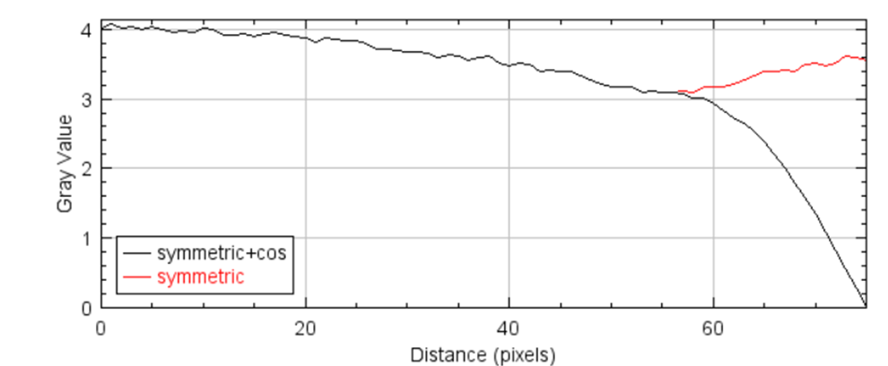

# 截断伪影 (Truncated artifact)

### 1. 伪影的表现形式

如图1 所示，截断伪影表现为图像边缘异常发亮，严重时无法观察边缘重建区域。

<figure markdown>
  { width="300", loading=lazy, align=left }
  { width="300", loading=lazy, align=left }
  <figcaption>Fig 1. 腹部截断伪影</figcaption>
</figure>


### 2. 伪影的产生原因

- 截断伪影主要由于被扫描物体超出探测器视野而产生，根据其超出长度会产生不同严重程度的光亮，进而影响图像边缘部分成像。
- 截断在正弦图 [(哪里有正弦图？)](https://github.com/CandleHouse/Toolbox#2-preprocess) 上表现为超出图像宽度的弦波，这正是截断伪影光亮的产生原因。因为在 FBP 中，对正弦图的卷积会在边缘部分产生大幅度变化，使得重建图像边界不均匀。


### 3. 矫正方案

- 对正弦图左右两侧做 padding 操作 (mode='symmetric' 或 'reflect' 皆可)，使得超出边界的正弦图均匀下降至0即可。由于超出图像边界的部分并不在探测器视野 (FOV) 中, 所以我们并不关心 padding 的值是否严格正确。

<figure markdown>
{ width="25%", loading=lazy, align=left }
{ width="50%", loading=lazy, align=left }
<figcaption>Fig 2. padding结果, 用 cos 使正弦图截断处均匀下降至0</figcaption>
</figure>

!!! note "建议"

    padding 单侧长度一般为正弦图宽度的 10% (RTK)。


- 对 padding 后的正弦图进行重建，并根据探测器成像几何，裁剪出原来探测器视野FOV即可。

<figure markdown>
{ width="300", align=left }
{ width="300", align=left }
<figcaption>Fig 3. padding后重建，并裁剪 FOV</figcaption>
</figure>
### 4. 代码实现

```py linenums="1" title="截断伪影矫正关键代码"
# 1. combine all raw image under the directory and convert to sinogram
h, w = 237, 324
projs = [imreadRaw(file, h, w) for file in listDirectory(proj_folder, style='fullpath')]
sgm = projectionsToSinograms(projs)

# 2. padding all sinogram and save
pad_sgm = []
for slice in range(sgm.shape[0]):
    pad_sgm.append(padSinogram(sgm[slice], padding=20, smootherDecay=True))
imwriteRaw(pad_sgm, sgm_pad_path)

# 3. image reconstruction
# Use your own recon tool.

# 4. calculate radius reference and plot
rec_img = np.fromfile(rec_img_path, dtype=np.float32).reshape(60, 512, 512)
r_reference = fovCropRadius(SOD=750, SDD=1250, detWidth=399.168, reconPixSize=0.5)
x, y = drawCircle(rec_img[0], radius=r_reference)
plt.imshow(rec_img[0], cmap='gray')
plt.plot(x, y, 'b-.'), plt.legend(['crop reference']), plt.show()

# 5. crop and save
crop_rec_img = fovCrop(rec_img, r_reference - 2)
imwriteTiff(crop_rec_img, './rec/crop_f_abdomen.tif')
```

完整实现 [在这里 :octicons-heart-fill-24:{ .heart }](https://github.com/CandleHouse/ArtifactReduction/blob/master/TruncationArtifact/TruncArtifactCorrect.py)


*[注]：以上图片来自 ICRP 110 数字体模投影，模拟投影以及小动物 CT，仅供学习参考*
