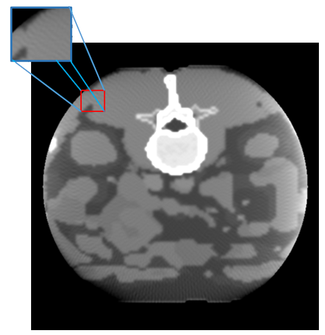
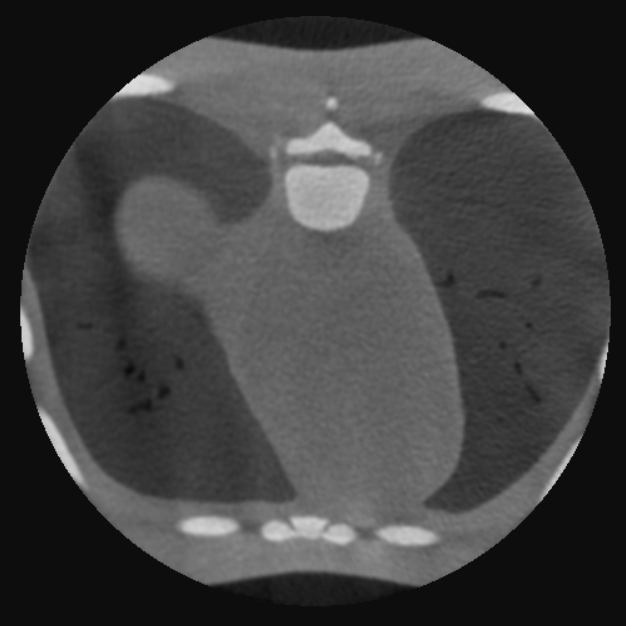
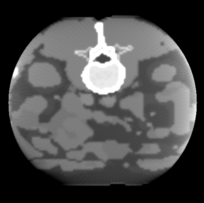
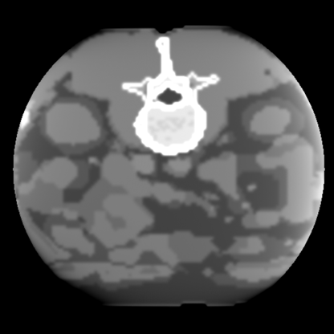
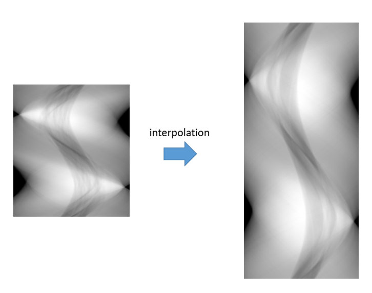
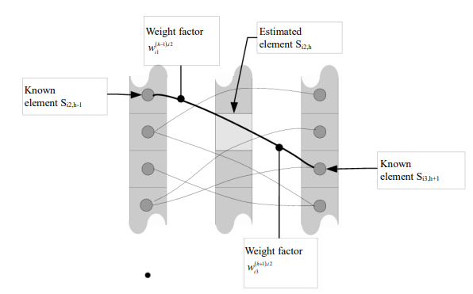
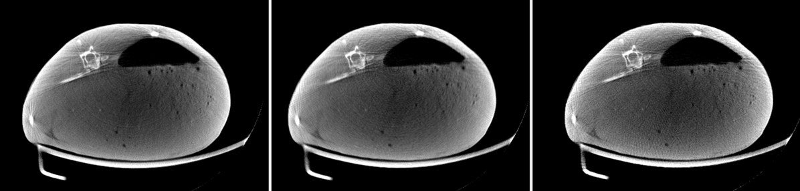

# 有限角伪影 (Limited view artifact)

### 1. 伪影的表现形式

有限角伪影有两种类型：

1. 稀疏视角 (Sparse view)：如图1. 左，表现为从中心向四周辐射的条带状细线。

2. 有限角度 (Limited angle)：如图1. 右，表现为横穿视野 FOV 的暗状条带。

<figure markdown>
  { width="290", loading=lazy, align=left }
  { width="300", loading=lazy, align=left }
  <figcaption>Fig 1. 有限角伪影</figcaption>
</figure>


### 2. 伪影的产生原因

#### 稀疏视角 (Sparse view)

- 虽然投影范围达到了360°，但是每张投影之间间隔角度过大，导致 FBP 重建时，反向涂抹间隔较大，最终造成条带状细线。
- 上图是一度一投影的重建结果。事实上，一般 CT 投影间距会小于 1°，也就是采用 400-800 个投影角做重建。有限角伪影往往发生在模拟实验中，或是有低剂量需求，减少投影数的场景下发生。
  
- 另外，在低剂量下，或高散射比 scatter primary ratio (SPR, 即散射比不带散射的投影值 $\frac{I_s}{I_p}$ ) 下，重建图像中的噪声会掩盖有限角伪影表现。在这种情况下，应优先矫正最影响图像质量的伪影。

#### 有限角度 (Limited angle)

- 有限角度的暗状条带主要是使用 FDK 重建算法导致的。FDK 本身是不精确的快速重建算法，远离探测器平面所在方向、有限角度投影都会使 FDK 伪影更加严重。

!!! info "注意"

    以上两者伪影产生的原因都是正弦图数据量不足导致的，其中以稀疏视角伪影处理研究较多，以下有限角伪影统指稀疏视角伪影。


### 3. 矫正方案

#### 方案1. 增加真实投影数量
最直接的方法就是增加投影数量，增加真实数据的投影数量，让重建的条带状细线结合的更加紧密，从而减轻有限角伪影。下图是用 720 个投影角重建的结果，其他参数不变，在同样分辨率下，有限角伪影几乎不可见。

<figure markdown>
  { width="300", loading=lazy, align=left }
  { width="300", loading=lazy, align=left }
  <figcaption>Fig 2. 有限角伪影矫正对比</figcaption>
</figure>


#### 方案2. 迭代重建 

迭代重建能够自适应的消除或减轻图像中的部分伪影，包括但不限于有限角伪影，低剂量噪声，杯状伪影等。

- 不过迭代重建方案往往需要在参数上精心选择，且高质量图像需要时间迭代，临床应用中相对较少。
- 不仅如此，在真实投影下，迭代重建需要对每张投影做几何校正，以防投影反投影中由于几何偏差带来的图像退化问题。

下表为使用 [TIGRE](https://github.com/CERN/TIGRE/blob/master/README.md#tigre-features) 迭代重建某目标对比，具有一定参考价值。

|  算法  |         OS-SART         |       OS-SART-TV        |          SART           | SART-TV             | SIRT                    | ISTA                    | FISTA                   |
| :----: | :---------------------: | :---------------------: | :---------------------: | ------------------- | ----------------------- | ----------------------- | ----------------------- |
| 速度 |   :material-check: 中   |   :material-check: 中   |   :material-close: 差   | :material-close: 差 | :material-check-all: 优 | :material-check-all: 优 | :material-check-all: 优 |
| 质量 | :material-check-all: 优 | :material-check-all: 优 | :material-check-all: 优 | :material-close: 差 | :material-close: 差     | :material-close: 差     | :material-close: 差     |

|  算法  |          MLEM           |      ASD-POCS       |     OS-ASD-POCS     | AWASD-POCS          | OS-AWASD-POCS       | PCSD                | CGLS                |
| :----: | :---------------------: | :-----------------: | :-----------------: | ------------------- | ------------------- | ------------------- | ------------------- |
| 速度 | :material-check-all: 优 | :material-close: 差 | :material-check: 中 | :material-close: 差 | :material-close: 差 | :material-close: 差 | :material-check: 中 |
| 质量 |   :material-close: 差   | :material-check: 中 | :material-close: 差 | :material-check: 中 | :material-check: 中 | :material-close: 差 | :material-check: 中 |

<figure markdown>
  <figcaption>Tab 1. 使用 TIGRE 实现的迭代重建算法对于某特定任务对比</figcaption>
</figure>

#### 方案3. 正弦图插值
当有条件限制，不能做更多投影数量时，有另一个思考角度。即对正弦图做高度方向插值，如图3. 左，相当于在真实投影之间补充虚拟投影，从而达到增加投影数的目的，减轻有限角伪影。

插值的方法多种多样，如直接使用双线性插值，或使用带有医学图像先验的正弦图插值方式，如图3. 右[^1]。

[^1]: M. Kalke and S. Siltanen, "Sinogram Interpolation Method for Sparse-Angle Tomography," Applied Mathematics, Vol. 5 No. 3, 2014, pp. 423-441. doi: 10.4236/am.2014.53043.

<figure markdown>
  { width="35%", loading=lazy, align=left}
  { width="50%", loading=lazy, align=left}
  <figcaption>Fig 3. 正弦图插值，左图为双线性插值，右图为其他插值方案</figcaption>
</figure>


- 如下图所示左，中，右分别为在50kVp下，兔子的 400 投影角，200投影角正弦插值到400投影角，以及200投影角重建。其中正弦图的插值方式采用双线性插值简单实现。

<figure markdown>
  { width="100%", loading=lazy }
  <figcaption>Fig 4. 兔子正弦图插值重建对比</figcaption>
</figure>


!!! warning "注意"

    毕竟增加的投影角并不是真实数据，加之使用双线性插值，会使得重建图像整体质量有一定下降，双线性插值这种图像处理方案在医学图像领域并不完全适用。


#### 方案4. DL介入

在方案3. 的基础上，使用神经网络赋予一定权重插值正弦图，已有不少学者进行相关研究，成果请移步最新学术期刊。


### 4. 代码实现

```py linenums="1" title="有限角伪影矫正关键代码"

pass
```

完整实现 [在这里 :octicons-heart-fill-24:{ .heart }](https://github.com/CandleHouse/ArtifactReduction/blob/master/TruncationArtifact/TruncArtifactCorrect.py)

*[注]：以上图片来自 ICRP 110 数字体模投影，模拟投影以及小动物 CT，仅供学习参考*