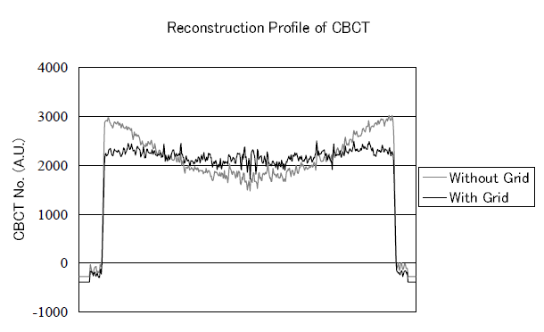

### 散射 (Scatter)

#### 方案0. 硬件矫正

类似水束硬化方案0. ，也可以采用滤波片对 X 射线进行预硬化，减少能谱低能部分，提高入射光子高能占比。这样就能减少大角度散射发生概率，从而减轻散射。

另一种物理矫正方案是使用准直器 (Collimator)，或滤线栅 (scatter rejecting grid)。Endo等[^3] 实验表明，这两者分别能将散射比 (S / P ratio) 降低为原来的 88% 和 73%。如图5. 所示[^3]，由散射引起的杯状伪影经过硬件矫正后提升明显。

[^3]: Endo M ,  Tsunoo T ,  Satoh K , et al. Performance of cone-beam CT using a flat-panel imager[J]. Proceedings of SPIE - The International Society for Optical Engineering, 2001.

<figure markdown>
  { width="80%", loading=lazy }
  <figcaption>Fig 5. 使用滤线栅前后对圆柱水模的线性度量</figcaption>
</figure>


#### 方案1. 卷积核矫正


### 4. 代码实现

#### 方案1. 卷积核矫正

```py linenums="1" title="杯状伪影矫正关键代码"
pass
```

完整实现 [在这里 :octicons-heart-fill-24:{ .heart }](https://github.com/CandleHouse/ArtifactReduction/blob/master/TruncationArtifact/TruncArtifactCorrect.py)


*[注]：以上图片来自 ICRP 110 数字体模投影，模拟投影以及小动物 CT，仅供学习参考*