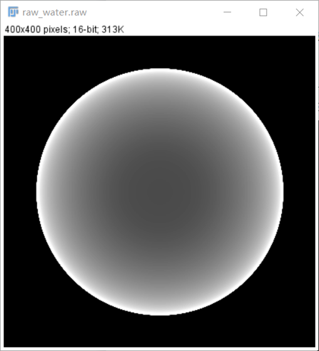
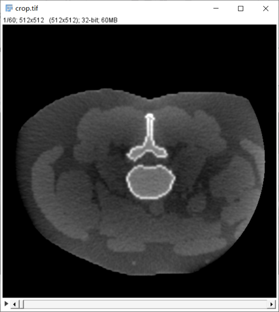
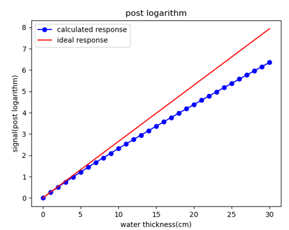

# 杯状伪影 (Cupping artifact)

### 1. 伪影的表现形式

杯状伪影表现为重建图像中，由四周向图中心的值下降，这也是 Cupping 名称的由来。主要由以下两种类型：

1. 水束硬化引起的杯状 (Water beam-hardening)， 如下图1. 左，为 16cm 模拟水模发生的水束硬化。
1. 散射引起的杯状 (Scatter)， 如下图1. 右，为散射引起的杯状。

<figure markdown>
  { width="300", loading=lazy, align=left }
  { width="300", loading=lazy, align=left }
    <figcaption>Fig 1.杯状伪影</figcaption>
</figure>

### 2. 伪影的产生原因

#### 水束硬化 (Water beam-hardening)

!!! tip "什么是硬化？"
    在 **X 光谱**通过厚度逐渐增加的水模时，总体能量下降，但整个光谱各能量会逐渐向高能移动，这种现象被称为 ”光束硬化“ (beam hardening)[^1]。

[^1]: Jiang H . Computed Tomography Principles, Design, Artifacts, and Recent Advances, 2nd Edition[M].  2009. P271.

- 下面我们从公式角度出发，分析光束硬化带来的影响：

  考虑一个能发射**单能 X 射线**的理想光源，且入射路径中只穿过一种类型的物质，它服从比尔朗伯定律 (Beer-Lambert law)：

$$
I=I_0e^{-\int\mu{(E,S)}ds}\tag{1}
$$

其中，$I$ 为探测器收到的能量积分，$I_0$ 为光源射出能量积分，$\mu_{E,S}$ 为射线穿过的物体衰减系数 ([物体衰减系数在哪获得？](../附录.md))。重建时，postlog 值 $I_p=-ln(\frac{I}{I_0})$。显然，$I_p$ 与 $\mu_{E,S}$ 之间为线性关系。

当理想**单能 X 射线**变为**X 光谱**时，比尔朗伯定律变为：

$$
I = I_0\int\Omega(E)e^{-\int\mu{(E,S)}ds}dE\tag{2}
$$

显然，$I_p$ 与 $\mu_{E,S}$ 之间不再满足线性关系，无论射线穿过物质路径长度是多少，测量得到的投影值 $I_p$ 总是小于真实值。

<figure markdown>
  { width="350", loading=lazy, align=left }
  <figcaption>Fig 2. 水模的模拟投影与理想线性关系对比</figcaption>
</figure>

#### 散射 (Scatter)

- waiting

!!! info "注意"

    ????

### 3. 矫正方案

由水束硬化和散射引起的杯状伪影原因并不相同，故需要不同的处理方案：

#### [矫正方案：水束硬化](./水束硬化.md)

#### [矫正方案：散射](./散射.md)

*[注]：以上图片来自 ICRP 110 数字体模投影，模拟投影以及小动物 CT，仅供学习参考*