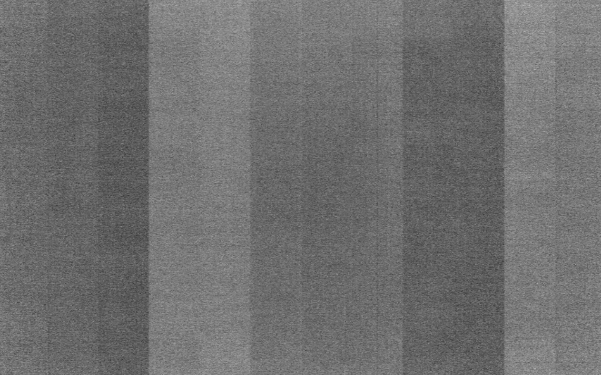

# 环状伪影 (Ring artifact)

### 1. 伪影的表现形式

环状伪影表现为从视野 FOV 正中心向外的一系列同心圆。如下图1. 左所示，为 QRM 空间分辨率评估模体，存在环状伪影。图1. 右 为同一环境下兔子重建图像，也存在环状伪影。

<figure markdown>
  { width="250", loading=lazy, align=left }
  { width="400", loading=lazy, align=left }
  <figcaption>Fig 1. 环状伪影</figcaption>
</figure>


### 2. 伪影的产生原因

环状伪影产生的原因主要是探测器像素响应不一致。这种情况多发生在多个半导体模块拼接而成的探测器板 (如下图2. 所示为能量积分型探测器 EID 暗场投影图)，各模板响应的差异在CT 图像上表现为特殊的低频环状伪影。

<figure markdown>
  { width="300", loading=lazy, align=left }
  <figcaption>Fig 2. 暗场空拍投影</figcaption>
</figure>


!!! info "注意"
    环状伪影通常发生在真实重建图像中。模拟数据一般不会有环状伪影，否则可能是像素位置没有对齐。

### 3. 矫正方案
#### 方案1. 亮场平滑[^1]

[^1]: Altunbas C , Chao‐Jen Lai,  Zhong Y , et al. Reduction of ring artifacts in CBCT: Detection and correction of pixel gain variations in flat panel detectors[J]. Medical Physics, 2014, 41(9).

简化一下文中步骤，直接对空气投影 $I_0$ 做平滑，即可减轻重建后图像域的环状伪影。同时，进一步减去暗场，也有一定的矫正意义：

$$
I_p=-ln\left(\frac{I_d-I_{dark}}{I_0-I_{dark}}\right)\tag{1}
$$

矫正后的 QRM 空间分辨率评估模体如下图3. 右所示，这种简单的处理方案可能引起图像质量退化，但并没有显著降低空间分辨率：

<figure markdown>
  { width="300", loading=lazy, align=left }
  { width="300", loading=lazy, align=left }
  <figcaption>Fig 1. 环状伪影</figcaption>
</figure>

!!! warning "注意"
    使用不同的平滑方式，以及不同形状的 kernel，都会影响重建结果。如果 kernel 过大，图像质量将退化严重。


#### 方案2. 多材料预矫正[^2]

[^2]: Feng M ,  Ji X ,  Zhang R , et al. An experimental method to correct low-frequency concentric artifacts in photon counting CT[J]. Physics in Medicine & Biology, 2021, 66(17):175011 (21pp).

使用有机玻璃板和铝板预矫正，该方法同时能矫正水束和骨硬化伪影

### 4. 代码实现

#### 方案1. 亮场平滑

注意，平滑的亮场为能量积分或光子计数，根据其数量级可能要自己实现相应滤波函数。

```py linenums="1" title="环状伪影矫正关键代码"
for file, name in tqdm(listDirectory(raw_path, style='both')):
    proj = np.fromfile(file, dtype=np.uint16)[offset:].reshape(H, W)
    # smooth with median filter
    if filter:
        k = 5
        nPadU, nPadD, nPadL, nPadR = k // 2, k // 2, k // 2, k // 2
        temp = np.pad(proj.astype(np.float32), ((nPadU, nPadD), (nPadL, nPadR)), mode='reflect')
        proj = MedianFilter(temp, k)
        proj = proj[nPadU:nPadU+H, nPadL:nPadL+W]

    tifffile.imwrite(tif_path + name.replace('.raw', '.tif'), proj)
```

完整实现 [在这里 :octicons-heart-fill-24:{ .heart }](https://github.com/CandleHouse/ArtifactReduction/blob/master/RingArtifact/RingArtifactCorrect.py#L15)

*[注]：以上图片来自 ICRP 110 数字体模投影，模拟投影以及小动物 CT，仅供学习参考*
