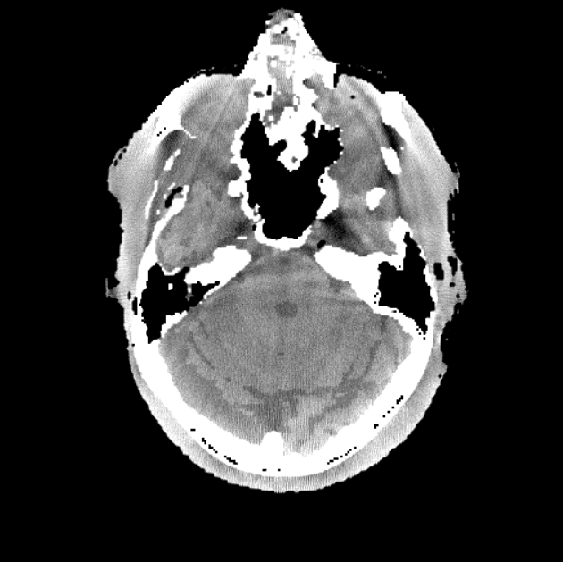

# 硬化伪影 (Beam-hardening artifact)

### 1. 伪影的表现形式

硬化伪影表现为高密度物质之间的暗带，通常产生于头部，也称 **骨硬化** 伪影，如图1. 左所示。**骨硬化 **伪影的另一种表现形式是骨-脑界面退化，边界模糊不清。

当扫描对象身体中具有其他高密度物质时，也会产生硬化伪影。如图1. 中，右所示[^1]，为造影剂下小鼠肺部重建图和身体中有钛金属嵌入产生的硬化伪影重建图。

[^1]: Jiang H . Computed Tomography Principles, Design, Artifacts, and Recent Advances, 2nd Edition[M].  2009. P280, 282.

<figure markdown>
  { width="250", loading=lazy, align=left }
  { width="300", loading=lazy, align=left }
  { width="270", loading=lazy, align=left }
  <figcaption>Fig 1. 硬化伪影</figcaption>
</figure>

### 2. 伪影的产生原因

当入射 x 光能量升高时，物质衰减系数 $\mu$ 会降低。因此，当 x 光谱穿透物体时，整个光谱的平均能量将提升，从而导致硬化伪影。

在人体组织中，不同物质材料的衰减系数对能量依赖并不相同。其中，骨头具有更高的有效原子序数 $Z$，骨衰减系数的光电效应部分所占比重更大：

$$
\begin{equation}\begin{split}
\mu(E)&=\rho\times\frac{N_A}{A}\times\left(\frac{k\times Z^m}
{E^3}+Z\times\sigma_{KN}(E)\right)\\
&=\frac{\rho Z^mN_A}{A}\times\frac{k}{E^3}+\frac{\rho ZN_A}{A}\times\sigma_{KN}(E)\\
\end{split}\end{equation}
$$

其中，左侧为光电效应部分，右侧为康普顿散射部分，KN 为 Klein-Nishina，m 取值 3 到 4 之间。

随着能量升高，骨头的衰减系数比软组织的衰减系数降低更快。因此，水束硬化矫正并不能完全矫正骨硬化伪影。

此外，当身体中存在与水原子序数相差很大的物质，如造影剂等，水束硬化矫正也会失效。这些高密度物质的衰减特性与水相差很大，使得水束矫正无法发挥作用，如下图2. 所示，仅对图1. 左，做水束硬化矫正，虽然软组织不均匀情况得到缓解，但仍存在骨硬化伪影。

<figure markdown>
  { width="350", loading=lazy }
  <figcaption>Fig 2. 对 Fig 1. 左做水束硬化矫正结果，并不能矫正骨硬化</figcaption>
</figure>
### 3. 矫正方案

#### [矫正方案：水束硬化](../杯状伪影/水束硬化.md)

#### [矫正方案：骨硬化](./骨硬化.md)

#### [矫正方案：金属硬化](./金属硬化.md)

*[注]：以上图片来自 ICRP 110 数字体模投影，模拟投影以及小动物 CT，仅供学习参考*